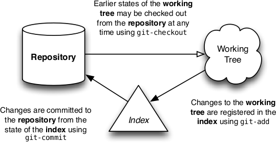

****************************************
get control of your source code with git
****************************************

Today:

  * install git on your laptop
  * set up a github account
  * fork a repo (github)
  * clone it to your laptop
  * make some changes
  * commit the changes to your laptop repo
  * push your new commits to your fork
  * optional: issue a pull request

Useful links:

  * Github - especially their help pages http://github.com
  * Git From the Bottom Up - http://ftp.newartisans.com/pub/git.from.bottom.up.pdf

the repository concept
======================

(image from Git From the Bottom Up)

commits and branches
====================

(image from Git From the Bottom Up)

merging
=======

(image from Git From the Bottom Up)
